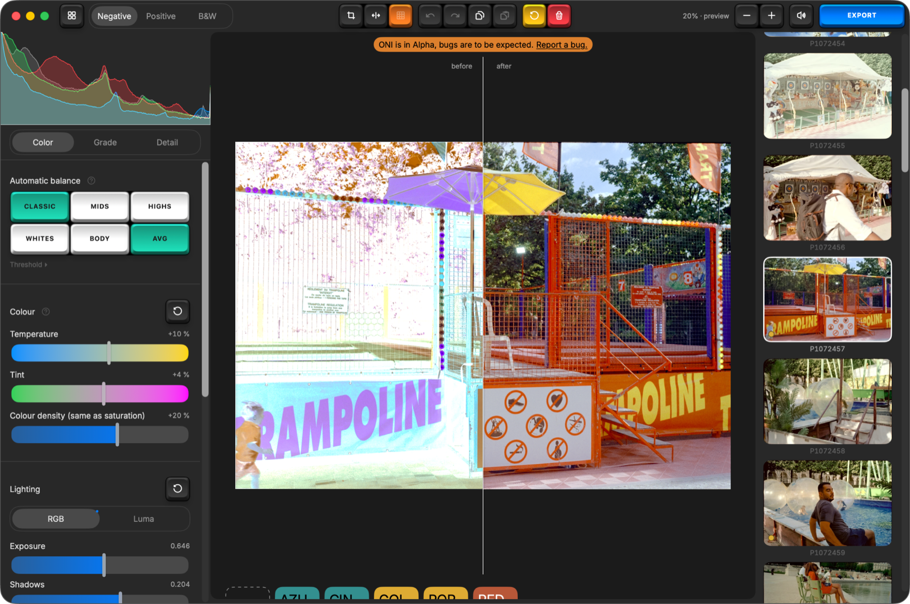

  

<h1 align="center">Open Negative Initiative</h1>

  Convert and edit scanned film (negatives and positives) on macOS. 
  Free, native, and floating point from the RAW to the file it writes.

  
  
  
  
  

  <a href="https://github.com/5e1y/open-negative-initiative-releases/releases/latest/download/OpenNegative.dmg">
    <strong>↓ Download for macOS</strong></a>
  &nbsp;·&nbsp;
  <a href="https://open-negative-initiative.com/">Website</a>
  &nbsp;·&nbsp;
  <a href="https://github.com/5e1y/open-negative-initiative-releases/releases">All versions</a>

  

---

## What it does

- **Inverts in density.** The sliders behave linearly in stops, so a correction reads
  like an exposure change instead of a curve fight.
- **Nothing decides on its own.** No film-base detection, no preset applied on import. The
  automatic balance runs on a click, your scanned film's personality comes out naturally.
- **Camera scans and flatbed scans.** RAW, DNG and TIFF in, a linear Rec. 2020 working space
  throughout, 16-bit TIFF or JPEG out in the colour space you pick.

## Features

**Converting**

- **Negative, positive, black & white** — the frame's own nature, set in the top bar, not a preset.
- **Automatic balance, six ways** — Classic, Mids, Highs, Whites, Body and their average. Each wins
  on films the others lose; none is right everywhere, which is why there are six.
- **Source balance** — per-channel gains, ±3 stops, where a dichroic head would act.
- **Per-channel levels** — black, shadows, midtone, highlights and white, placed on a density axis
  you can read, with the histogram measured before the handles so it does not move under them.
- **Density ceiling** — how far up the axis is read, to pull separation out of a burnt patch.
- **Flat-field correction** — a vendored mask divided out before anything else, for lens falloff.

**Grading**

- **Colour** — temperature and tint as filters, plus colour density, acting after the conversion.
- **Lighting** — exposure, shadows, highlights and the two end points, on RGB or luma.
- **Contrast** — a single slider on a C² spline, so no banding and no flat grey.
- **Finishing balance** — five zones per channel, black to white, that never drag the end points.
- **Zone saturation** — saturation split on luminance, shadows to highlights.

**Detail**

- **Chroma denoise** — colour noise only; the luma comes out bit-identical, so grain survives.
- **Sharpening and texture** — dosed in full-resolution pixels, with a loupe that renders at 1:1
  because no fitted preview can show what the exported file will get.

**Framing**

- **Crop, rotation, straighten, two mirrors** — the whole photograph stays visible under an angle,
  and a locked ratio survives a quarter turn.

**Library**

- **Sidecars are the truth** — one JSON beside each original; the database is a cache you can throw
  away without losing an adjustment.
- **Films** — group frames into a roll with ⌘G and name it; the gallery cuts on rolls, not days.
- **Contact sheets** — a selection laid six to a row in one file, edited and exported as one photo.
- **Presets** — one file each, shared by sending it. Five film presets ship with the app.
- **Copy and paste settings** — row by row, over a whole selection. Framing is never carried over.
- **Relink** — a moved or unplugged original is found again by fingerprint, not by file name.

**Exporting**

- **16-bit TIFF or JPEG**, in sRGB, Display P3 or Adobe RGB, resized or not.
- **Weighed before you commit** — the sheet estimates the file size from a preview, within 2 %.
- **The capture date and nothing else** — no camera body, no lens, no serial number: those are the
  scanner's settings, not the photograph's.

## Installing

Open the DMG and drag the app onto the Applications folder beside it. If macOS says it cannot
verify the app, open **System Settings → Privacy & Security**, scroll to the bottom and click
**Open Anyway** — right-click → Open no longer does this on recent macOS.

The app looks for updates on its own and never installs one without asking. Release notes are shown
before you accept, and their first line always says whether a version changes how a photograph you
have already adjusted will render.

## Reporting something

Open an [issue](https://github.com/5e1y/open-negative-initiative-releases/issues). Two things make a
report usable: **the version**, which the About window reads on its own, and **the RAW file** if it
is a colour or decoding problem — a screenshot shows the symptom, the file reproduces it.

A picture that opens flat or nearly white is worth reporting even though nothing crashed.

## Source code

**Not in this repository** — this one holds the builds and the update feed. The app is licensed
**GPL-3.0** and its source will be published when it leaves beta: the constants that decide how a
negative renders are still being calibrated against real film, and forks of a moving render would
scatter versions that disagree about what a photograph should look like.
