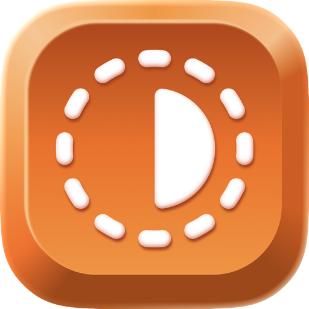
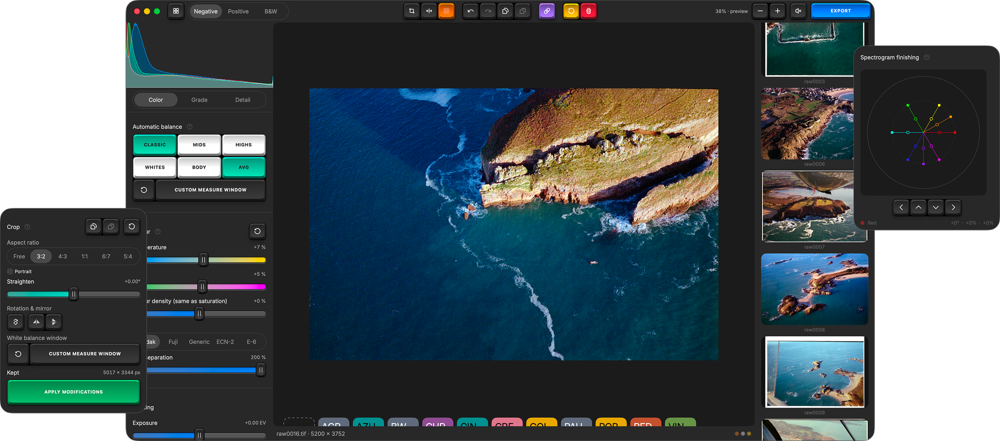
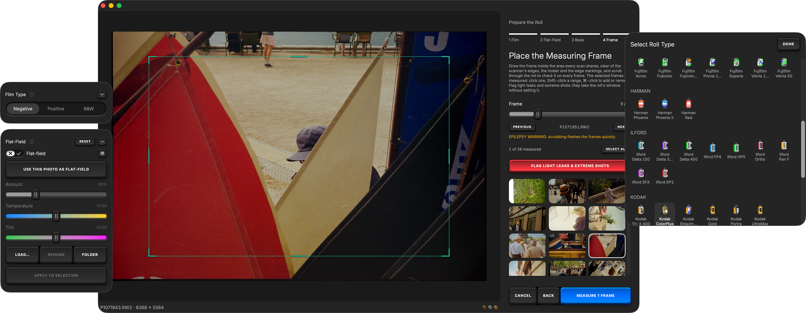
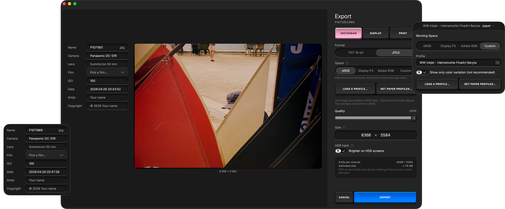

  

<h1 align="center">Open Negative Initiative</h1>

  Convert and edit scanned film on macOS: colour negatives, slides and black &amp; white. 
  Each roll measured whole, its colour managed to the file. Free and open source.

  
  
  
  

  <!-- Through the website, which counts the click and redirects; the file still comes from this
       repository's latest release. `download_count` counts bytes served to anything that asks, and
       cannot tell this button apart from a crawler or from Sparkle updating an existing copy. -->
  <a href="https://open-negative-initiative.com/dl?t=readme">
    <strong>↓ Download for macOS</strong></a>
  &nbsp;·&nbsp;
  <a href="https://open-negative-initiative.com/">Website</a>
  &nbsp;·&nbsp;
  <a href="https://open-negative-initiative.com/guide">Quick guide</a>
  &nbsp;·&nbsp;
  <a href="https://open-negative-initiative.com/manual">Manual</a>
  &nbsp;·&nbsp;
  <a href="https://github.com/5e1y/open-negative-initiative-releases/releases">All versions</a>

  

---

## What it does

- **Measures a roll as a whole.** Prepare the Roll asks four things only you can answer: the film
  type and what digitised it, a flat-field from a frame of the empty light panel, the film base
  picked under a loupe, and one measuring frame for the whole roll. Measure then reads every frame
  and sets one window the roll opens on: each channel's gain is the roll's median, its ends the
  second most extreme frame, so a light leak never sets the range.
- **Inverts in density**, not with `1 − x`, so every slider behaves linearly in stops.
- **Manages colour to the file.** One working space for the canvas and the export, sRGB, Display P3,
  Adobe RGB or a paper's ICC profile, so what you edit is what the file holds. Floating point from
  the decode to the export.
- **Nothing decides on its own.** No film-base detection, no preset applied on import. Auto White
  Balance and Auto Exposure run only when you press them, and one ⌘Z takes them back.
- **Your originals are only read.** Point it at the folder that holds your scans: its folders are
  the archive, nothing is copied, and the settings live in a sidecar beside each file.

  

## Features

**The roll**

- **Prepare the Roll**, from the gallery's PREPARE ROLL key or the first frame of a roll never
  measured. Flag light leaks and extreme shots: they take the roll's window without setting it.
  Frames captured with other shutter, aperture or ISO settings are evened out from their EXIF.
- **The Roll tab** holds what a roll shares, and a gesture there reaches every frame of the roll:
  film type, flat-field, source encoding, source balance, density ceiling, per-channel levels, dye
  separation (five families, Kodak, Fuji, Generic C-41, ECN-2 and E-6) and balance strength.
- **A contact sheet** is laid by every measurement, six frames to a row on the roll's own window.

**A frame**

- **Color.** Auto White Balance, Temperature and Tint, which move the colour and never the light,
  and colour density. Lighting with Auto Exposure, Exposure, Highlights, Shadows, White point and
  Black point. Scanner Emulation with ONI, Noritsu and Frontier looks, off at rest. Effects
  (Contrast, Vignette, Chrome), Curves, Spectrogram Finishing and a Saturation Curve.
- **Crop.** Aspect ratio, straighten, rotate and mirror, and a framing of its own to copy and paste
  across a roll.
- **Details.** Sharpening, chroma denoise that leaves the luma bit-identical so the grain survives,
  texture, and a loupe at full resolution.
- **De-dust.** A brush and a classical search on the GPU for a matching patch in the same frame. No
  neural network, and nothing happens without a stroke of yours.
- **Copy and paste** carry the Color and Details tabs; PASTE TO ROLL lays them on every frame of the
  roll.
- **Scanner mode** lays the balance, colour, density and framing on a lab scanner's keyboard.

**The archive**

- **The folders on your disk are the archive.** A roll is a folder that carries its film, and wears
  its film stock as its icon. Drag photos, rolls and folders onto a folder to move them; ⌘Z puts
  them back.
- **Projects** gather frames across rolls, a photo in one project at a time.
- **Medals**, Bronze, Silver and Gold, with a filter that shows one at a time.

**Export**

- **A screen of its own**, with three presets, Instagram, Display and Print, that set every row and
  lock none.
- **16-bit TIFF or JPEG**, in sRGB, Display P3, Adobe RGB or a paper's ICC profile, converted by
  ColorSync. The size rides one edge and never enlarges.
- **An HDR gain map** on JPEG exports. It changes no pixel: an HDR screen shows the picture up to two
  stops above the white of the page, and every other reader sees the same picture.
- **EXIF per frame**: camera, lens, film, ISO, date, artist and copyright, opened on the scan's own
  EXIF so you can see whose facts those are and replace them. Nothing else of the original is
  written.

  

## Installing

macOS 13 Ventura or later, on Apple Silicon or Intel: one universal build for both.

Open the DMG and drag the app onto the Applications folder beside it. If macOS says it cannot
verify the app, open **System Settings → Privacy & Security**, scroll to the bottom and click
**Open Anyway**. Right-click then Open no longer does this on recent macOS.

The app looks for updates on its own and never installs one without asking. Release notes are shown
before you accept, and their first line always says whether a version changes how a photograph you
have already adjusted will render.

## Reporting something

The **FEEDBACKS** key in the app opens an issue here with no account at all. You can also open an
[issue](https://github.com/5e1y/open-negative-initiative-releases/issues) on GitHub. Two things make
a report usable: **the version**, which the About window shows, and **the RAW file** if it is a
colour or decoding problem: a screenshot shows the symptom, the file reproduces it.

## Source code

Open Negative Initiative is **GPL-3.0**, and **every release carries its complete source**, attached
to that release as `OpenNegative-<version>-source.zip`: the Swift code, the Metal kernels, the
resources, the package manifest, the Makefile and a README that lists what building it takes.

**Take the file with `-source` in its name**, not the "Source code (zip)" GitHub attaches on its own:
that one archives *this* repository, which holds the builds and the update feed.

How the app works, stage by stage and with the research behind it, is written on
[the website](https://open-negative-initiative.com/features), and
[the source page](https://open-negative-initiative.com/open) says what the licence gives you.
